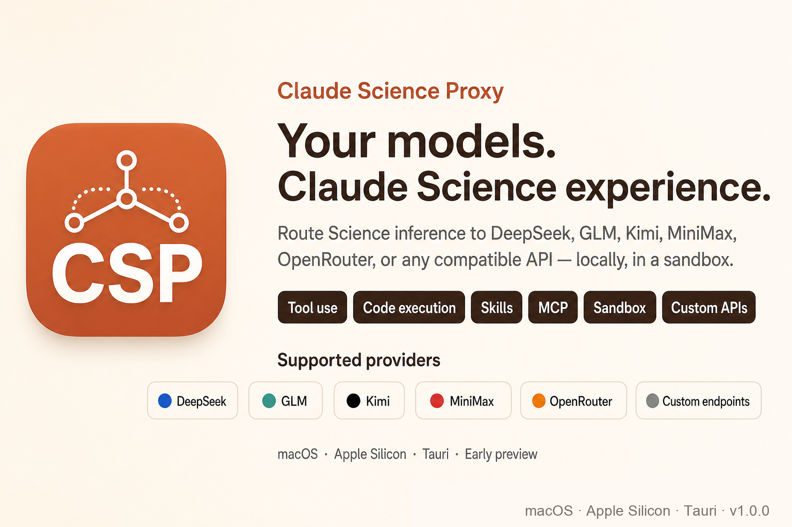

<p align="center">
  
</p>

<p align="center">
  
  
  
</p>

<p align="center">
  <a href="./README.md">简体中文</a> ·
  <a href="./README.en.md">English</a>
</p>

# CSSwitch

CSSwitch 是一个给 Claude Science 使用的本地模型切换器。它把 Science 的推理请求接到你自己的第三方模型 API 上，让没有 Claude 订阅的用户也能在 Science 里使用 DeepSeek、通义千问、Kimi、MiniMax、GLM、OpenRouter、中转站或自定义兼容端点。

它面向的不只是开发者：你只需要准备 Claude Science、一个第三方 API Key，然后在桌面面板里新建配置、设为当前、点击「一键开始」。

> 当前版本主要支持 macOS Apple Silicon。首次打开未公证的 `.dmg` 应用时，macOS 可能需要你右键选择「打开」。

[下载最新版](../../releases/latest) · [更新日志](./CHANGELOG.md) · [报告问题](https://github.com/SuperJJ007/CSSwitch/issues/new?template=bug_report.yml) · [功能建议](https://github.com/SuperJJ007/CSSwitch/issues/new?template=feature_request.yml)

## 目录

- [为什么需要 CSSwitch](#为什么需要-csswitch)
- [可以做什么](#可以做什么)
- [快速开始](#快速开始)
- [支持的模型来源](#支持的模型来源)
- [状态诊断与能力 catalog](#状态诊断与能力-catalog)
- [它如何保护你的真实账号](#它如何保护你的真实账号)
- [哪些能力暂时用不了](#哪些能力暂时用不了)
- [多语言](#多语言)
- [开发与构建](#开发与构建)
- [风险与免责声明](#风险与免责声明)

## 为什么需要 CSSwitch

Claude Science 是 Anthropic 面向科研与分析场景的 AI Agent 应用，可以做文献分析、数据处理、代码执行、图表生成和论文写作等工作。但 Science 默认依赖 Claude 登录和 Anthropic 推理服务。

CSSwitch 做的是本地运行控制：

- 在隔离环境里启动 Claude Science。
- 为 Science 准备一份本地生成的启动门票，不复制你的真实 Claude 登录信息。
- 把 Science 的模型请求转发到你选择的第三方 provider。
- 在需要时把 Anthropic Messages API 和 OpenAI 兼容接口互相转换。
- 保留「官方 Claude」模式，让有订阅的用户可以随时回到真实 Science。

简单理解：CSSwitch 之于 Claude Science，类似 CC Switch 之于 Claude Code，但 Science 多了登录门票和沙箱隔离这层复杂度。

```text
Claude Science sandbox
  -> CSSwitch local proxy
  -> DeepSeek / Qwen / Kimi / MiniMax / GLM / OpenRouter / custom endpoint
```

## 可以做什么

**给普通用户**

- 用桌面面板管理多套模型配置，不需要手改环境变量。
- 同一家 provider 可以保存多套配置，例如不同 Key、不同模型、不同中转地址。
- 点击「设为当前」前会先验证 Key；失败不会悄悄切换到坏配置。
- 点击「一键开始」会自动启动代理、准备隔离环境、打开 Science。
- Science 顶部模型选择器会显示你选择的真实模型名，而不是笼统的 `claude` 或 `opus`。
- 可以一键切回「官方 Claude」模式，不干扰你的真实 Claude 登录。

**给进阶用户**

- 支持原生 Anthropic 兼容端点、OpenAI Chat Completions 兼容端点、OpenAI Responses 兼容端点。
- 支持自定义 `base_url`、模型名和中转站。
- DeepSeek、Kimi、MiniMax 等原生 Anthropic 端点优先透传，尽量保留工具调用、thinking 和流式响应。
- Qwen 与自定义 OpenAI 端点通过本地代理做协议转换。
- 配置和日志都保存在本机，便于自查和反馈。

## 快速开始

开始之前，请确认你已经安装：

- [Claude Science](https://claude.com)
- macOS Apple Silicon 设备
- 一个可用的第三方模型 API Key
- `python3`（当前代理仍需要；后续计划移入 Rust，减少运行时依赖）

1. 从 [GitHub Releases](../../releases/latest) 下载最新的 `CSSwitch_*.dmg`。
2. 将 CSSwitch 拖入「应用程序」。
3. 第一次打开如果被 Gatekeeper 拦截，请右键应用并选择「打开」。
4. 保持顶部模式为「第三方模型」。
5. 点击「+ 新建」，选择 provider，填写 API Key、模型和必要的 `base_url`。
6. 点击「创建」，再在配置列表中点击「设为当前」。
7. 验证通过后点击「一键开始」。
8. CSSwitch 会启动隔离 Science，并在浏览器中打开入口。

如果你有 Claude 订阅，只想正常使用官方 Claude Science，切到「官方 Claude」模式即可。CSSwitch 会停止第三方代理链路，再打开真实 Science。

## 支持的模型来源

| 来源 | 接入方式 | 说明 |
|---|---|---|
| DeepSeek | 原生 Anthropic 端点 | 默认来源，尽量保留 thinking、工具调用和流式能力 |
| 通义千问 Qwen | OpenAI Chat Completions 兼容端点 | 由 CSSwitch 代理转换为 Science 需要的 Anthropic 格式 |
| 智谱 GLM | Anthropic 兼容端点 | 可编辑官方默认地址，可选择或自填模型 |
| 小米 MiMo | Anthropic 兼容端点 | 支持改到套餐或区域端点 |
| 硅基流动 | Anthropic 兼容端点 | 可选择或自填模型 |
| Kimi / Moonshot | Anthropic 兼容端点 | 可编辑官方默认地址，支持 Kimi 系列模型 |
| MiniMax | Anthropic 兼容端点 | 可编辑官方默认地址，支持 MiniMax 系列模型 |
| OpenRouter | Anthropic 兼容聚合入口 | 可选择或自填模型 |
| 自定义 Anthropic | 自填兼容端点 | 适合私有网关、Claude 兼容中转站、本地适配器 |
| 自定义 OpenAI | 自填 OpenAI Chat Completions base root | 代理自动补 `/chat/completions` 与 `/models` |
| 自定义 OpenAI Responses | 自填 OpenAI Responses base root | 代理自动补 `/responses` 与 `/models` |

> 如果你的地址是 `/anthropic` 端点，请选择「自定义 Anthropic」。如果选择「自定义 OpenAI」，请填写 OpenAI 兼容的 base root，例如 `https://example.com/v1`，不要填 Anthropic 端点。

## 状态诊断与能力 catalog

CSSwitch 内置了只读的 capability catalog，用来把 provider、工具调用、MCP/skill、Science 版本和 transport 的已知兼容性边界显式化。运行时 `status` 诊断会返回当前 profile 命中的 catalog 规则和固定边界规则，便于定位「当前配置为什么这样处理」以及「哪些能力只能诊断或降级」。

这个 catalog 是诊断与可观测性入口，不是 live provider、真实 Claude 账号态、Science GUI E2E、DMG 签名/公证或官方托管能力的验证结果。看到 catalog rule id 只表示 CSSwitch 记录了对应规则或边界；不表示外部 provider、Anthropic-hosted MCP、Directory connectors、remote skills 已被完整验证或修通。

状态灯也只表示当前可观测的本地状态：例如沙箱灯是本地 HTTP health，不等于已证明该端口一定属于本沙箱 Science。`自检` 默认不会读取真实 `~/.claude-science`；只有显式设置 `CSSWITCH_DOCTOR_CHECK_REAL_HOME=1` 才会做真实 HOME 存在性检查。

## 它如何保护你的真实账号

CSSwitch 的核心边界是：第三方模型模式只把凭证、数据目录和网络代理放在隔离环境里，不接管你的真实 Claude 账号。

- 不复制、读取或修改真实 Claude 登录凭证、OAuth token、账号状态或用户数据。
- 首次初始化沙箱时，可能会从真实 `~/.claude-science` 只读克隆 Science 运行时资源（如 `bin`、`conda`、`runtime`、`seed-assets`）；这些不是账号凭证或对话数据。
- 隔离 Science 使用独立 HOME、独立端口和独立数据目录。
- 第三方 API Key 保存在 `~/.csswitch/config.json`，文件权限为 `0600`。
- Key 通过环境变量传给本地代理，不写入命令行参数或日志。
- 代理只监听 `127.0.0.1`，并使用路径 secret 验证请求。
- 代理收到请求后会移除 Science 自带的 `Authorization` / `x-api-key`，再注入你配置的第三方 Key。
- 官方 Claude 模式会拆掉第三方代理链路，再把你交回真实 Science。

## 哪些能力暂时用不了

CSSwitch 不是 Claude 官方服务，也不会让本地生成的启动门票获得 Anthropic 账号权限。以下限制是当前架构边界：

- Anthropic 托管的远程 MCP 服务不可用，例如 `pubmed`、`clinical-trials`、`chembl`、`biorxiv` 等 `*.mcp.claude.com` 服务。
- 依赖真实 Claude 账号授权的目录连接器、远程插件、云端能力可能会显示 session expired、unavailable 或 skipped。
- 第三方模型对工具调用、长上下文、thinking、图片和流式输出的兼容程度不同；原生 Anthropic 端点通常比 OpenAI 翻译路径更稳。
- 当前 macOS 包尚未 Apple 公证，首次启动需要手动放行。
- 当前运行时仍依赖 `python3` 启动代理；移到 Rust 单二进制是后续计划。

已知问题和排期见 [docs/known-issues.md](./docs/known-issues.md)。

## 多语言

README 目前提供：

| 语言 | 文件 |
|---|---|
| 简体中文 | [README.md](./README.md) |
| English | [README.en.md](./README.en.md) |

应用界面当前以中文为主。README 多语言不代表桌面应用 UI 已经完成多语言切换；后续如果应用内 i18n 落地，会在这里单独说明。

## 反馈与社区

遇到问题时，建议先说明：

- CSSwitch 版本
- macOS 版本与芯片架构
- 使用的 provider 和模型
- 操作步骤
- `~/.csswitch/logs/` 中相关日志

提交日志前请删除 API Key、令牌、邮箱、私有 URL 和任何敏感数据。

- [报告 Bug](https://github.com/SuperJJ007/CSSwitch/issues/new?template=bug_report.yml)
- [提出功能建议](https://github.com/SuperJJ007/CSSwitch/issues/new?template=feature_request.yml)
- [查看更新日志](./CHANGELOG.md)

<p align="center">
  
</p>

## 开发与构建

用户不需要从源码运行。以下内容只给想调试或参与开发的人。

```bash
cd desktop
npm install
npm run tauri dev
```

常用检查：

```bash
bash test/run_all.sh
bash test/run_all.sh --require-release-ready

python3 -m unittest test.test_proxy_units test.test_provider_policy test.test_proxy_packaging -v
(cd desktop/src-tauri && cargo test)
node --check desktop/src/main.js
```

更多开发说明见：

- [desktop/README.md](./desktop/README.md)
- [docs/DEVELOPMENT.md](./docs/DEVELOPMENT.md)
- [docs/provider-support.md](./docs/provider-support.md)
- [docs/verified-facts.md](./docs/verified-facts.md)

## 风险与免责声明

- 本项目仅供个人学习与研究使用，使用风险由用户自行承担。
- CSSwitch 与 Anthropic 不存在从属、合作或背书关系。
- 推理请求会发送到你自行配置并付费的第三方模型服务。
- 本地生成的 Science 启动门票不包含真实 Anthropic 凭证，也不授予 Anthropic 官方账号权限。
- Science 启动时仍可能访问内置的 profile、account 或服务发现接口；CSSwitch 会在第三方模型模式下尽量把这些请求隔离或快速失败，因此本文不使用「完全不接触 Anthropic」这类绝对表述。
- 对 Science 登录令牌加密格式的分析和本地启动门票实现，可能涉及相关服务条款与法律问题。具体适用性应由专业人士判断。
- 软件按「现状」提供，不作任何形式的担保。

## 致谢

CSSwitch 的名字和产品形态参考了 [CC Switch](https://github.com/farion1231/cc-switch)。两个项目彼此独立，不存在从属或背书关系。

## 许可

[MIT](./LICENSE)
